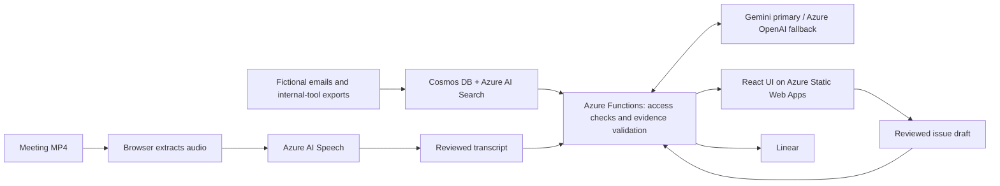

# Deeproot 🌱

**Client context in. A cited report and a reviewed next action out.**

Built for **GirlHacks 2026**, with the ADP and Avanade tracks in mind.

[Open the live demo](https://jolly-mushroom-03fc6bf0f.3.azurestaticapps.net/) · [Five-minute demo script](docs/DEMO_SCRIPT.md) · [Product requirements](docs/PRD.md)

## The problem

A client asks for something in an email. An internal tracker records a dependency. A meeting ends with “let me confirm with the team.” The context is scattered, nobody is clearly responsible, and a reassuring follow-up can promise more than the evidence supports.

Deeproot connects those records before and after a meeting, makes the supporting excerpts inspectable, and turns a human-reviewed draft into a Linear issue.

## See it in five minutes

Our fictional client, **Northstar Logistics**, plans its first payroll on October 15. Tax setup is still incomplete for 38 employees in Ohio and Pennsylvania. An internal email sets an October 8 dependency, while the implementation tracker lists a conflicting October 22 go-live date and no assignee.

1. **Prepare:** read the account brief and inspect its email and internal-tool evidence.
2. **Process the meeting:** upload an MP4 recording or use the prepared transcript, then review and correct the text.
3. **Review the report:** inspect decisions, commitments, delivery risks, and open questions. An unconfirmed owner or date stays **Unknown**.
4. **Act:** edit the Linear draft and acceptance criteria, then create the issue after review. A pending attempt keeps its saved identity for reconciliation.
5. **Ask and verify:** ask what is needed by October 8, or check “Everything is on track for October 15.” Inspect the citations behind the answer.
6. **Prove the integration:** in the configured local live workspace, open **Apps**, assign the sample tracker dependency to Sam, save upstream, and sync. Inspect the updated source, refreshed brief, and the cited answer to “Who owns IT-5120?”
7. **Check account boundaries:** ask about BetaCo. The Northstar presenter has no access to that account's records.

The [meeting script](demo/meeting-script.md) explains how to prepare the recording.

## What makes Deeproot useful

- **Context across sources:** emails, meeting transcripts, an implementation tracker, and payroll configuration records tell one connected story.
- **Inspectable evidence:** citations open the original source text. The server checks quotes against permitted records and removes invalid citations.
- **Honest uncertainty:** missing owners and unsupported dates are not silently filled in.
- **Human review before action:** the user reviews both the transcript and the issue draft. The model does not autonomously send client messages or create work.
- **Account-scoped retrieval:** server authorization and retrieval filters constrain the records supplied to the model.
- **Resilient workflow:** transcription can fall back to a clearly labelled prepared transcript; an unconfigured Linear integration offers a prefilled form. An uncertain creation outcome is reconciled before manual creation is offered.

Ask, Verify, analysis and reports also check factual meaning against cited evidence in a separate model phase. This remains a fallible model check; inspect evidence before acting. Ask and Verify use server-controlled retrieval, at most two retrieval rounds and four successful model phases, within a 40-second deadline. Completed investigation steps show actual searches and checks. Verify exposes individual claim verdicts and withholds unverified rewrites.

## How it works



| Technology | Role |
| --- | --- |
| React, TypeScript, Vite, Motion | Account workspace and forest-themed interface |
| Azure Static Web Apps + Functions | Hosted frontend and API |
| Azure AI Speech | WAV transcription and speaker diarization |
| Azure AI Search | Account- and user-filtered source retrieval |
| Azure Cosmos DB | Accounts, sources, reports, latest briefs and integration records; durable Linear attempt coordination |
| Google Gemini | Primary configured language model |
| Azure OpenAI | Configured fallback for transient primary-model failures |
| Linear GraphQL API | Reviewed issue creation and identity-based reconciliation |
| Bicep | Azure infrastructure definitions |

## Demo boundaries

All client records are **fictional**. The Gmail-style mailbox is a simulation; no Gmail, Microsoft 365, or ADP tenant is connected. Optional editable **Implementation Tracker** and **Payroll Configuration** sample tools expose real CRUD/export APIs. Deeproot fetches their exports over authenticated HTTP, normalizes them, checks permissions and indexes them. Upstream edits stay separate until sync. This demonstrates an integration workflow with fictional systems, not an ADP integration claim.

The deployed demo uses `DEMO_USER_ID=presenter`, so every visitor acts as the Northstar presenter without signing in. **Create Linear issue is a real action when the integration is configured.** BetaCo remains outside the presenter's allowed account scope.

Local mock mode uses fixed example answers and reports and only **previews** issues. It rejects custom-transcript generation; use its labelled prepared walkthrough. Live mode uses the configured backend and model-generated reports; its inbox shows API-supplied emails without fictional filler. Upload an MP4, import a `.txt` transcript, or paste your own meeting. A failed live transcription returns an error; the prepared transcript is a separate, explicit demo choice. Unidentified speakers retain their service labels. Brief analyses refresh after five minutes or source changes, with only the latest stored per account/user in memory or the configured Cosmos briefs container. New report revisions preserve previous reports and actions, and show a comparison. No established action means no Linear creation.

Ask supports follow-up conversation and cites fresh permitted records. Ask and Verify decline unrelated tasks and individual pay, personal tax and banking requests. Recognizable personal payroll content is screened from imports and model context. These safeguards are **not compliance certification or a complete PII classifier**; real connectors must exclude sensitive employee records and preserve their source permissions. See [real-data readiness and Glean comparison](docs/REAL_DATA_READINESS.md) for current capabilities and the smallest integration steps.

The repository's updated behavior must be deployed before it appears at the live URL. Deployment-wide Linear reconciliation is covered by simulated provider/storage tests; use the explicit live verification command below to check provider behavior before release.

## Run locally without credentials

Use Node.js 22 and npm from the repository root:

```sh
npm ci
npm run dev --workspace web
```

Open the URL Vite prints (normally `http://localhost:5173`). Mock mode is the default, with no API keys or Azure resources required.

For a local backend and editable sample tools, install Azure Functions Core Tools v4. Configure only the model credentials in ignored `api/.env` if you want real AI responses; hosted Azure settings do not automatically reach your laptop. Then run:

```sh
npm run configure:local -w api
npm run start:local -w api
# In a second terminal:
npm run dev:live
```

MP4 clips must be under 25 MB and 13 minutes, with a browser-supported audio track (AAC recommended). The browser extracts mono PCM audio; video frames are not uploaded. Text transcript import remains available.

Vite proxies `/api` to the local Functions host on port 7071. The generated ignored profile selectively copies model settings, enables fictional apps, and disconnects cloud storage, Search, Speech and Linear. Stub mode starts the tools without credentials but cannot perform AI analysis. Use `npm run verify:local -w api` for the real-model rehearsal against local fictional data. See the [setup guide](infra/README.md). Never commit environment files or service keys.

## Validate

```sh
npm test
npm run typecheck
npm run build:functions --workspace api
npm run build:live
```

Provider verification and Azure setup are documented in [infra/README.md](infra/README.md). Live verification can create a disposable Linear issue only when explicitly requested with its creation flag; normal tests use fakes. Pushing to `main` currently does **not** deploy: this repository has no automatic deployment workflow. Manual deployment builds fresh live frontend output and stops if that output is missing.

## Explore the project

| Folder | Contents |
| --- | --- |
| `web/` | React workspace, mock API, and evidence navigation |
| `api/` | Handlers, grounding, ingestion, provider adapters, and Linear coordination |
| `shared/` | API contracts and shared domain helpers |
| `demo/` | Fictional records, example report, and meeting script |
| `infra/` | Bicep resources, deployment scripts, and Search schema |
| `docs/` | [PRD](docs/PRD.md), [architecture/build plan](docs/BUILD_PLAN.md), [adapter contracts](docs/AZURE_INTEGRATION.md), and [demo script](docs/DEMO_SCRIPT.md) |
